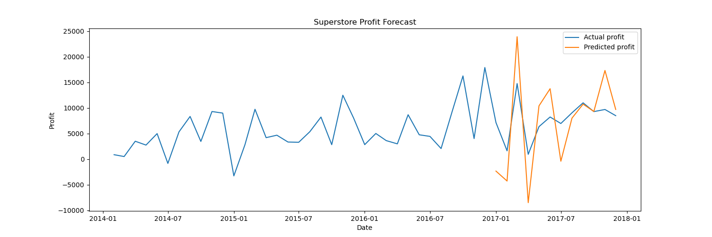
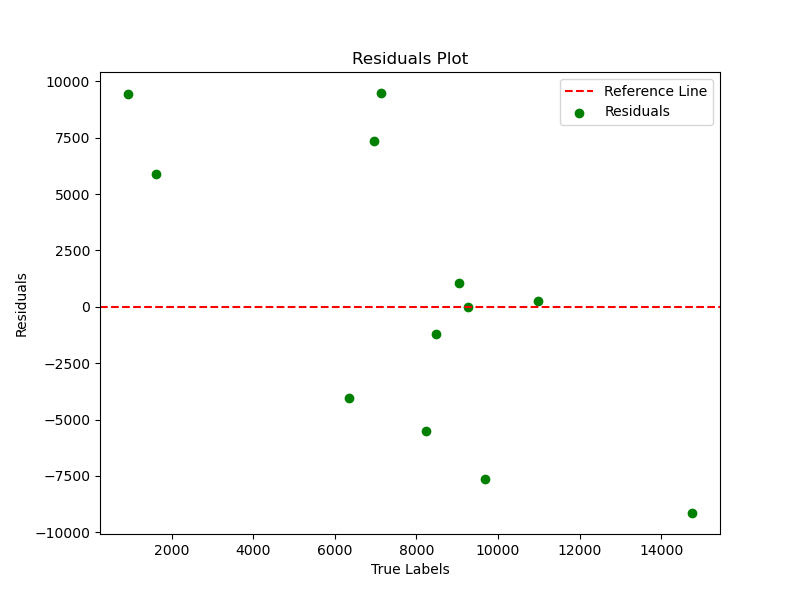

# Profit Forecasting Model - Linear Regression

## Overview
This project involves predicting monthly profit for a Superstore dataset using a Linear Regression model. The model was trained on monthly profit data, applying differencing for stationarity, feature scaling, and splitting the data into training and testing sets.

## Model Performance

**Linear Regression Metrics**:
- Mean Squared Error (MSE): 6185.47
- Mean Absolute Error (MAE): 5087.98
- R² Score: 0.53

## Model Performance Plot

### Insights
- **MSE & MAE**: These error metrics indicate a relatively high level of prediction error. A lower MSE and MAE would reflect better model accuracy.
- **R²**: The R² score of 0.53 suggests the model explains about 53% of the variance in the data. This indicates moderate performance, but there's room for improvement.

 
### Reasons for Poor Performance
1. **Data Preprocessing**: While differencing helped in making the data stationary, it might have resulted in loss of important information or reduced the model's ability to capture seasonal patterns effectively.
2. **Model Choice**: Linear regression is a basic approach and may not capture complex relationships in time series data. Time series models like ARIMA or machine learning methods like XGBoost could perform better for forecasting.
3. **Feature Engineering**: Using only profit and date (with lagged features) may not fully capture the complexities of profit trends, such as seasonality, external factors, or product-specific trends.

## Next Steps and Improvements

- **Try Advanced Models**: Instead of Linear Regression, consider using:
  - **ARIMA** or **SARIMA** models specifically designed for time series forecasting.
  - **XGBoost** or **Random Forest** to capture non-linear relationships.
  - **LSTM** (Long Short-Term Memory) networks for sequential data predictions.
  
- **Feature Engineering**:
  - Include additional variables such as marketing campaigns, discounts, or region-based sales to provide more context to the model.
  - Investigate seasonal decomposition to separate seasonal, trend, and residual components before training the model.

## Skills Portrayed

- **Data Preprocessing**: 
  - Data cleaning, handling missing values, and feature engineering (lagging).
  - Time-series transformation and differencing to stabilize variance and remove trends.
  - Feature scaling using MinMaxScaler to enhance model performance.

- **Exploratory Data Analysis (EDA)**: 
  - Visualizing data trends and relationships.
  - Identifying patterns and outliers in the dataset.

- **Model Development**: 
  - Implementing Linear Regression for time-series forecasting.
  - Model training and evaluation using key metrics: Mean Squared Error (MSE), Mean Absolute Error (MAE), and R² Score.

- **Evaluation and Visualization**: 
  - Performance evaluation of predictions through scatter plots and residual plots.
  - Visualizing model fit with actual vs. predicted profit.

- **Programming & Tools**: 
  - Proficiency in Python, libraries like Pandas, NumPy, Scikit-learn, Matplotlib, and XGBoost.
  - Application of machine learning workflows in a real-world dataset.

- **Hyperparameter Tuning**: For machine learning models, use techniques like cross-validation and grid search to tune hyperparameters for better performance.

## Conclusion
- The model provides a basic predictive framework, but there is room for improvement in accuracy. Exploring more advanced models and hyperparameter tuning will be key to enhancing performance. While Linear Regression provided a baseline for profit forecasting, it struggles to handle the complexities of time series data. Transitioning to more advanced models such as ARIMA, XGBoost, or LSTM, and improving feature engineering should lead to better predictions. In future iterations, exploring model ensembles and hyperparameter optimization would further enhance model accuracy.

# Outputs 

# Data prep
RangeIndex: 9994 entries, 0 to 9993
Data columns (total 2 columns):
 #   Column      Non-Null Count  Dtype
---  ------      --------------  -----
 0   Order Date  9994 non-null   datetime64[ns]
 1   Profit      9994 non-null   float64

# Data split 
Train data shape (23, 13)
Test data shape (12, 13)
Train data shape (23, 13)
Test data shape (12, 13)
X_train_shape (23, 12)
y_train_shape (23,)
X_test_shape (12, 12)
y_test_shape (12,)

## actual profit output
[7140.439099999999, 1613.8719999999996, 14751.891500000002, 933.2899999999988, 6342.582799999997, 8223.335699999996, 6952.6212, 9040.955699999999, 10991.555600000005, 9275.2755, 9690.103699999996, 8483.346799999994]

## Predictions output
[-0.78931581 -0.51448577  0.63771063 -0.78573442  0.24758865  0.36016367
 -0.62724351 -0.14233613 -0.08271183 -0.06052844  0.52067661  0.03014894]

## Predictd test set output 
[[ -9481.71247634  13873.9018     -12231.735        6914.4849
    7266.5883      -2370.8086       -317.5002      -3911.7683
    5684.3315       -634.1531      -1392.6115       2179.7562
   -5192.1426    ]
 [ -5894.40593962 -10744.8702      13873.9018     -12231.735
    6914.4849       7266.5883      -2370.8086       -317.5002
   -3911.7683       5684.3315       -634.1531      -1392.6115
    2179.7562    ]
 [  9145.00450566  -5526.5671     -10744.8702      13873.9018
  -12231.735        6914.4849       7266.5883      -2370.8086
    -317.5002      -3911.7683       5684.3315       -634.1531
   -1392.6115    ]
 [ -9434.96530402  13138.0195      -5526.5671     -10744.8702
   13873.9018     -12231.735        6914.4849       7266.5883
   -2370.8086       -317.5002      -3911.7683       5684.3315
    -634.1531    ]
 [  4052.81310426 -13818.6015      13138.0195      -5526.5671
  -10744.8702      13873.9018     -12231.735        6914.4849
    7266.5883      -2370.8086       -317.5002      -3911.7683
    5684.3315    ]
 [  5522.23443961   5409.2928     -13818.6015      13138.0195
   -5526.5671     -10744.8702      13873.9018     -12231.735
    6914.4849       7266.5883      -2370.8086       -317.5002
   -3911.7683    ]
 [ -7366.21221624   1880.7529       5409.2928     -13818.6015
   13138.0195      -5526.5671     -10744.8702      13873.9018
  -12231.735        6914.4849       7266.5883      -2370.8086
    -317.5002    ]
 [ -1036.8041959   -1270.7145       1880.7529       5409.2928
  -13818.6015      13138.0195      -5526.5671     -10744.8702
   13873.9018     -12231.735        6914.4849       7266.5883
   -2370.8086    ]
 [  -258.53913404   2088.3345      -1270.7145       1880.7529
    5409.2928     -13818.6015      13138.0195      -5526.5671
  -10744.8702      13873.9018     -12231.735        6914.4849
    7266.5883    ]
 [    31.01671164   1950.5999       2088.3345      -1270.7145
    1880.7529       5409.2928     -13818.6015      13138.0195
   -5526.5671     -10744.8702      13873.9018     -12231.735
    6914.4849    ]
 [  7617.38064356  -1716.2801       1950.5999       2088.3345
   -1270.7145       1880.7529       5409.2928     -13818.6015
   13138.0195      -5526.5671     -10744.8702      13873.9018
  -12231.735     ]
 [  1214.61209281    414.8282      -1716.2801       1950.5999
    2088.3345      -1270.7145       1880.7529       5409.2928
  -13818.6015      13138.0195      -5526.5671     -10744.8702
   13873.9018    ]]

   # New list to store predictions
   Order Date  Linear Prediction
0  2017-01-01       -2341.273376
1  2017-02-01       -4280.533940
2  2017-03-01       23896.896006
3  2017-04-01       -8501.675304
4  2017-05-01       10395.395904
5  2017-06-01       13745.570140
6  2017-07-01        -413.591016
7  2017-08-01        8004.151504
8  2017-09-01       10733.016466
9  2017-10-01        9306.292212
10 2017-11-01       17307.484344
11 2017-12-01        9697.958893

## How to run code
# 1. Run as uploaded for the functions
# 2. Uncomment print/plot code blocks to view output results for each relevant section
# 3. Find all visualization outputs in repository
